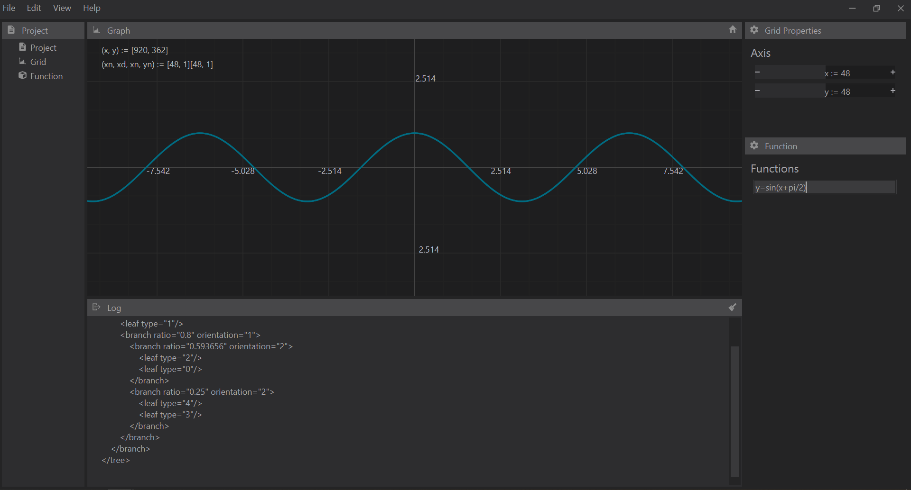

# Jam

A starting point for a desktop graphing calculator with Qt.

- Features a Blender like binary tree widget layout system.
- Postfix based text compiler to evaluate functions and store variables.
- Serializes project via xml.

## Current State

It is out of date with the current module system.  The layout needs to be factored and moved to the view module. The custom widgets need to be designed around the current system. Title drag / move / resize events need to be added to the main frame-less window. Text evaluation needs to be factored onto a sub-module.

In its current state it should be scraped and referenced for parts.
