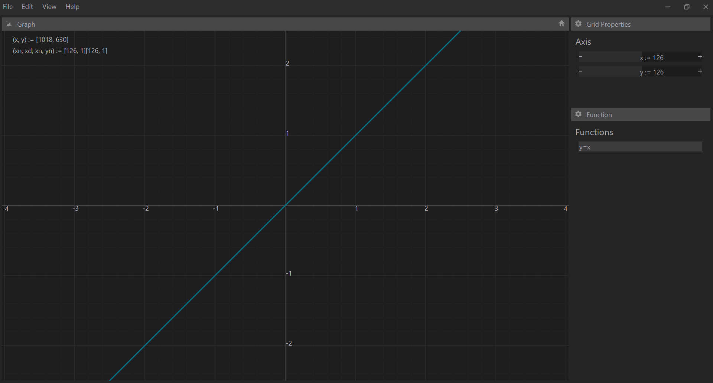

# Jam

A starting point for a desktop graphing calculator with Qt.

- Features a Blender like binary tree widget layout system.
- Postfix based text compiler to evaluate functions and store variables.
- Serializes project via xml.

